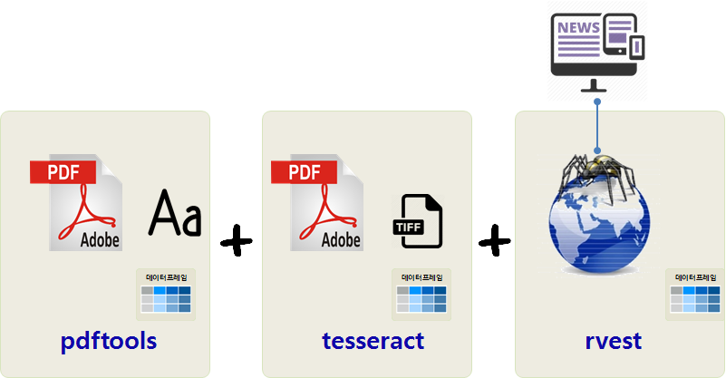

``` {r, include=FALSE}
source("tools/chunk-options.R")
knitr::opts_chunk$set(echo = TRUE, warning=FALSE, message=FALSE, fig.width=12)

library(tidyverse)
library(rvest)
library(tesseract)
library(pdftools)
library(stringr)
library(forcats)
library(ggpubr)
library(extrafont)
loadfonts()
library(gridExtra)
library(lubridate)

```


## 1. 자동차 품질 지표 - IQS {#automotive-iqs}

미국 [JD 파워](http://www.jdpower.com/)가 매년 실시하는 미국시장 초기품질지수(Initial Quality Survey)는 
자동차 100대당 결함갯수를 나타나는 것으로 숫자가 낮을수록 자동차 초기 품질이 높다는 의미를 갖는다.

JD파워에서 해당 자동차를 실제로 구입한 사람들을 대상으로 실시하는 조사는 두가지가 유명하다.
초기품질조사는 구매한지 90일이 지난 소비자를 대상으로 한 조사이며,
자동차 내구성 조사(VDS, Vehicle Dependability Study)는 차량을 구매한 지 3년이 지난 소비자를 대상으로 한 조사다.

## 2. JD 파워 IQS 데이터 [^rvest-scraping] {#automotive-iqs-data}

[^rvest-scraping]: [rvest - Scraping HTML Tables](http://bradleyboehmke.github.io/2015/12/scraping-html-tables.html)

JD 파워 IQS 데이터가 [JD 파워](http://www.jdpower.com/) 웹사이트에서 
[U.S. New-Vehicle Quality Makes Largest Improvement in 7 Years, J.D. Power Study Finds](http://www.jdpower.com/press-releases/2016-us-initial-quality-study-iqs)와 같은 형태로 제공된다.
일부 뉴스에서 [Kia tops J.D. Power quality rankings amid shake-up](http://www.autonews.com/article/20170621/OEM01/170629948/2017-j-d-power-iqs-kia)에서도 
IQS 원데이터 형태로 제공한다. 이를 종합하면 JD 파워에서 원천데이터를 제공하는데 기본은 PDF 파일인데 특정년도는 PDF내부 이미지 형태로 제공하기 때문에 OCR 기법을 활용해서 데이터를 추출해야한다.

- PDF 파일에서 텍스트를 추출하여 표형태 데이터로 변환
- PDF 파일에서 이미지를 추출하여 OCR을 통해 표형태 데이터로 변환
- 웹사이트에서 데이터를 긁어와서 표형태 데이터로 변환



### 2.1. 환경설정 {#automotive-iqs-data-package}

OCR을 위한 `tesseract`, PDF 데이터 추출을 위한 `pdftools`, 웹사이트 긁어오기 위한 `rvest` 3종 팩키지 외에,
텍스트 데이터 전처리를 위한 `stringr` 및 필요한 팩키지도 함께 준비한다.

``` {r auto-iqs-data-setup, eval=FALSE}
# 0. 환경설정 ---------------
library(tidyverse)
library(rvest)
library(tesseract)
library(pdftools)
library(stringr)
library(forcats)
library(ggpubr)
library(extrafont)
loadfonts()
library(gridExtra)
library(lubridate)
```

### 2.2. 데이터 가져오기 {#automotive-iqs-data-import}

pdf 파일을 가져오는 것은 2011 - 2016년까지 동일하나 제공되는 IQS 정보가 PDF 텍스트냐, 
이미지냐에 따라 처리방향이 다르다.
텍스트인 경우 PDF 파일에서 텍스트를 추출하여 IQS 제조사와 결함갯수(문제갯수)만 정규표현식을 활용하여 추출하여 
데이터프레임으로 저장한다. 

이미지인 경우 PDF 파일에서 이미지를 추출하여 `tiff` 형태로 저장하고 이를 바탕으로 텍스트를 추출하여 마찬가지로 
IQS 제조사와 결함갯수(문제갯수)만 정규표현식을 활용하여 추출하여 
데이터프레임으로 저장한다. 

IQS 2017년 데이터의 경우 `rvest` 팩키지를 활용하여 웹사이트에서 IQS 데이터를 긁어와서 IQS 제조사와 결함갯수(문제갯수)만 정규표현식을 활용하여 정제해서
데이터프레임으로 저장한다. 

- 2011: [Initial Quality of Recent Vehicle Launches is Considerably Lower than in 2010, While Carryover Model Quality is Better than Ever](http://www.jdpower.com/press-releases/2011-initial-quality-study)
- 2012: [https://www.autohaus.de/](https://www.autohaus.de/fm/3478/Initial%20Quality%20Study%202012.pdf)
- 2013: [Nearly Two-Thirds of Problems Owners Experience With Their New Vehicle Are Design-Related; Few Can be Fixed](http://www.jdpower.com/sites/default/files/2013087-iqs.pdf)
- 2014: [Initial Quality Problems Increase as Automakers Struggle to Launch Vehicles with Technology That Consumers Find Easy to Use](http://www.jdpower.com/press-releases/2014-us-initial-quality-study-iqs)
- 2015: [Korean Brands Lead Industry in Initial Quality, While Japanese Brands Struggle to Keep Up with Pace of Improvement](http://www.jdpower.com/sites/default/files/2015080_IQS.pdf)
- 2016: [U.S. New-Vehicle Quality Makes Largest Improvement in 7 Years, J.D. Power Study Finds](http://www.jdpower.com/sites/default/files/2016097_us_iqs.pdf)
- 2017: [New-Vehicle Initial Quality is Best Ever, J.D. Power Finds](http://www.jdpower.com/sites/default/files/2017085_u.s._iqs_v3.pdf)


``` {r auto-iqs-data-import}
# 1. 데이터 가져오기 ---------------
## 1.1. 2011 년 --------------------
iqs_2011_pdf <- pdf_text("data/2011-089-uiqs.pdf")

iqs_2011_lst <- unlist(strsplit(iqs_2011_pdf[4], split = "\\n"))
iqs_2011_lst <- iqs_2011_lst[5:37]
iqs_2011_lst <- str_replace_all(iqs_2011_lst, "^\\s*", "")
iqs_2011_lst <- str_split(iqs_2011_lst, "\\s{2,100}")

iqs_2011_df <- do.call(rbind, iqs_2011_lst) %>% 
  as_tibble() %>% 
  rename(제조사 = V1, 문제갯수=V2) %>% 
  mutate(문제갯수 = as.integer(str_replace_all(문제갯수, "\r", "")))

saveRDS(iqs_2011_df, "data_processed/iqs_2011_df.rds")

## 1.2. 2012 년 --------------------
iqs_2012_pdf <- pdf_text("data/2012-Initial Quality Study.pdf")

iqs_2012_lst <- unlist(strsplit(iqs_2012_pdf[1], split = "\\n"))
iqs_2012_lst <- iqs_2012_lst[5:39]
iqs_2012_lst <- str_replace_all(iqs_2012_lst, "^\\s*", "")
iqs_2012_lst <- str_split(iqs_2012_lst, "\\s{2,100}")

iqs_2012_df <- do.call(rbind, iqs_2012_lst) %>% 
  as_tibble() %>% 
  rename(제조사 = V1, 문제갯수=V2) %>% 
  mutate(문제갯수 = as.integer(str_replace_all(문제갯수, "\r", "")))

saveRDS(iqs_2012_df, "data_processed/iqs_2012_df.rds")

## 1.3. 2013 년 --------------------
iqs_2013_file <- pdftools::pdf_convert("data/2013-087-iqs.pdf", format = 'tiff', pages = 4, dpi = 400)
iqs_2013_lst <- ocr(iqs_2013_file)
unlink(iqs_2013_file)

iqs_2013_lst <- unlist(str_split(iqs_2013_lst, "\n"))
iqs_2013_lst <- iqs_2013_lst[5:38]

iqs_2013_maker <- purrr::map(str_extract_all(iqs_2013_lst, "[:alpha:]+"), str_c, collapse="") %>% unlist
iqs_2013_num <- str_extract_all(iqs_2013_lst, "[0-9]+$") %>% unlist

iqs_2013_df <- tibble(제조사=iqs_2013_maker, 문제갯수=iqs_2013_num) %>%
  mutate(문제갯수 = as.integer(문제갯수))

saveRDS(iqs_2013_df, "data_processed/iqs_2013_df.rds")

## 1.4. 2014 년 --------------------
iqs_2014_pdf <- pdf_text("data/2014-087_IQS.pdf")

iqs_2014_lst <- unlist(strsplit(iqs_2014_pdf[3], split = "\\n"))
iqs_2014_lst <- iqs_2014_lst[5:37]
iqs_2014_lst <- str_replace_all(iqs_2014_lst, "^\\s*", "")
iqs_2014_lst <- str_split(iqs_2014_lst, "\\s{2,100}")

iqs_2014_df <- do.call(rbind, iqs_2014_lst) %>% 
  as_tibble() %>% 
  rename(제조사 = V1, 문제갯수=V2) %>% 
  mutate(문제갯수 = as.integer(str_replace_all(문제갯수, "\r", "")))

saveRDS(iqs_2014_df, "data_processed/iqs_2014_df.rds")

## 1.5. 2015 년 --------------------
iqs_2015_file <- pdftools::pdf_convert("data/2015-080_IQS.pdf", format = 'tiff', pages = 3, dpi = 800)
iqs_2015_lst <- ocr(iqs_2015_file)
unlink(iqs_2015_file)

iqs_2015_lst <- unlist(str_split(iqs_2015_lst, "\n"))
iqs_2015_lst <- iqs_2015_lst[5:38]

iqs_2015_maker <- purrr::map(str_extract_all(iqs_2015_lst, "[:alpha:]+"), str_c, collapse="") %>% unlist
iqs_2015_num <- str_extract_all(iqs_2015_lst, "[0-9]+$") %>% unlist

iqs_2015_df <- tibble(제조사=iqs_2015_maker, 문제갯수=iqs_2015_num) %>%
  mutate(문제갯수 = as.integer(문제갯수))

saveRDS(iqs_2015_df, "data_processed/iqs_2015_df.rds")

## 1.6. 2016 년 --------------------
iqs_2016_file <- pdftools::pdf_convert("data/2016-097_us_iqs.pdf", format = 'tiff', pages = 4, dpi = 400)
iqs_2016_lst <- ocr(iqs_2016_file)
unlink(iqs_2016_file)

iqs_2016_lst <- unlist(str_split(iqs_2016_lst, "\n"))
iqs_2016_lst <- iqs_2016_lst[5:38]

iqs_2016_maker <- purrr::map(str_extract_all(iqs_2016_lst, "[:alpha:]+"), str_c, collapse="") %>% unlist
iqs_2016_num <- str_extract_all(iqs_2016_lst, "[0-9]+$") %>% unlist

iqs_2016_df <- tibble(제조사=iqs_2016_maker, 문제갯수=iqs_2016_num) %>%
  mutate(문제갯수 = as.integer(문제갯수))

saveRDS(iqs_2016_df, "data_processed/iqs_2016_df.rds")

## 1.7. 2017 년 --------------------
### 1.7.1. 데이터 가져오기 ---------------
autonews_webpage <- read_html("http://www.autonews.com/article/20170621/OEM01/170629948/2017-j-d-power-iqs-kia")

iqs_2017_dat <- autonews_webpage %>%
  html_nodes("table") %>%
  .[1] %>%
  html_table(fill = TRUE) %>% 
  .[[1]]

### 1.7.2. 데이터 정제 ---------------
iqs_2017_df <- iqs_2017_dat %>% as_tibble() %>% 
  select(1,3) %>% 
  filter(row_number() != 1) %>% 
  rename(제조사=X1, 문제갯수=X3) %>% 
  mutate(문제갯수 = as.integer(문제갯수))

saveRDS(iqs_2017_df, "data_processed/iqs_2017_df.rds")
```


## 3. JD 파워 IQS 시각화 {#automotive-iqs-viz}

PDF 파일 및 웹사이트에서 연도별로 추출하여 정제한 데이터를 `.rds` 파일형태로 저장했다면, 
다음 단계로 이를 불러와서 시각화 및 관련된 모형 작업을 수행한다.

### 3.1. 추출한 데이터 가져오기 및 정제 작업 {#automotive-iqs-viz-import}

PDF 파일 혹은 웹사이트에서 긁어오는 과정에서 제조사명에 오류가 있는 경우 수정하고, 시각화를 위해서 제조사 정보를 요인형 자료구조에 대해
수정 작업을 수행한다.

``` {r iqs-rds-data-import}
# 1. 데이터 가져오기 ---------------
## 1.1. 연도별 IQS 데이터 가져오기
iqs_2011_df <- readRDS("data_processed/iqs_2011_df.rds") %>% mutate(연도 ="2011")
iqs_2012_df <- readRDS("data_processed/iqs_2012_df.rds") %>% mutate(연도 ="2012")
iqs_2013_df <- readRDS("data_processed/iqs_2013_df.rds") %>% mutate(연도 ="2013")
iqs_2014_df <- readRDS("data_processed/iqs_2014_df.rds") %>% mutate(연도 ="2014")
iqs_2015_df <- readRDS("data_processed/iqs_2015_df.rds") %>% mutate(연도 ="2015")
iqs_2016_df <- readRDS("data_processed/iqs_2016_df.rds") %>% mutate(연도 ="2016")
iqs_2017_df <- readRDS("data_processed/iqs_2017_df.rds") %>% mutate(연도 ="2017")

## 1.2. IQS 데이터 병합

iqs_df <- bind_rows(iqs_2011_df, iqs_2012_df) %>% 
  bind_rows(iqs_2013_df) %>% 
  bind_rows(iqs_2014_df) %>% 
  bind_rows(iqs_2015_df) %>% 
  bind_rows(iqs_2016_df) %>% 
  bind_rows(iqs_2017_df)

# 2. 데이터 전처리 ------------------------
## 2.1. 제조사 코드 정리
iqs_df <- iqs_df %>% mutate(제조사 = case_when(
  제조사 == "IndustryAverage" ~ "Industry Average",
  제조사 == "LandRover" ~ "Land Rover",
  제조사 == "MercedesBenz" ~ "Mercedes-Benz",
  제조사 == "Mini" ~ "MINI",
  TRUE ~ 제조사
))

iqs_df %>% spread(연도, 문제갯수) %>% 
  DT::datatable()

## 2.2. 시각화 및 모형 데이터프레임 변환------
iqs_df <- iqs_df %>% 
  mutate(IQS산업평균 = ifelse(stringr::str_detect(제조사, "Industry Average"), "산업평균", "제조사")) %>%
  mutate(현대기아 = case_when(
    stringr::str_detect(제조사, "Kia") ~ "기아",
    stringr::str_detect(제조사, "Hyundai") ~ "현대",
    stringr::str_detect(제조사, "Industry Average") ~ "산업평균",
    TRUE ~ "해외업체"
  )) %>% 
  mutate(제조사 = factor(제조사),
          현대기아 = factor(현대기아, levels=c("기아", "현대", "산업평균", "해외업체")))
```

### 3.2. 최근 특정년도 제조사별 IQS 점수   {#automotive-iqs-viz-by-maker}

가장 최근 2017년 IQS 초기품질조사 결과를 시각화한다.

``` {r iqs-rds-data-by-2017}

# 3. 시각화 ---------------
## 3.0. 색상 팔레트 설정
iqs_hkmc_cols <- c(기아 = "#ff0000",
                   현대 = "#0000ff",
                   산업평균 = "#5b5b5b",
                   해외업체 = "#b7b7b7")

## 3.1. 색상 팔레트 설정
iqs_df %>% filter(연도 == "2017") %>% 
  ggplot(aes(x = reorder(제조사, -문제갯수), y = 문제갯수, fill = 현대기아 ) ) +
    geom_bar(stat = "identity") +
    scale_fill_manual(values=iqs_hkmc_cols) +
    geom_text(aes(label=문제갯수), vjust=0.5, hjust=-0.5) +
    coord_flip() +
    labs(x="", y="자동차 100대당 문제갯수", title="2017년 JD 파워 초기 품질조사") +
    theme_pubclean(base_family="NanumGothic")
```

### 3.3. 최근 4년 제조사별 IQS 점수 변화  {#automotive-iqs-viz-four-years}

최근 4년 제조사별 IQS 점수를 시각화해서 제조사별로 IQS 점수 변화를 시각적으로 확인해 볼 수 있다.

``` {r iqs-rds-data-viz-four-years, fig.height=12}
## 3.2. IQS 시각화 함수

barplot_iqs <- function(year) {
  iqs_df %>% filter(연도 == year) %>% 
    ggplot(aes(x = reorder(제조사, -문제갯수), y = 문제갯수, fill = 현대기아) ) +
    geom_bar(stat = "identity") +
    scale_fill_manual(values=iqs_hkmc_cols) +
    geom_text(aes(label=문제갯수), vjust=0.5, hjust=-0.5, size=3) +
    scale_x_discrete(labels = abbreviate) +
    coord_flip() +
    labs(x="", y="", title=paste0("JD 파워 초기 품질조사: ", year)) +
    theme_pubclean(base_family="NanumGothic") +
    theme(legend.position = "none",
          axis.text=element_text(size=7),
          plot.title = element_text(size=10),
          axis.text.x=element_blank(),
          axis.ticks.x=element_blank())
}

# barplot_iqs("2011")  

## 3.3. 최근 4년 시간순 비교

for(year in 2012:2017) {
  plot_name <- paste0("iqs_p", year)
  assign(plot_name, barplot_iqs(year))
}

plot_list <- mget(paste0("iqs_p", 2014:2017))

do.call(grid.arrange, plot_list)
```

### 3.4. 2011-2017년 연도별 IQS 점수 변화 추세  {#automotive-iqs-viz-trend}

2011-2017년 연도별 IQS 점수 변화에 대한 추세도 살펴볼 수 있다.

``` {r iqs-rds-data-viz-trend, fig.height=12}
# 4. 시계열 분석 ---------------------

iqs_df %>% mutate(연도 = make_date(year=연도, month="01", day="01")) %>% 
  ggplot(aes(x=연도, y=문제갯수, group=제조사, color=현대기아)) +
    geom_point() +
    geom_line() +
    scale_color_manual(values=iqs_hkmc_cols) +
    geom_text(aes(label=문제갯수), vjust=0.5, hjust=-0.5, size=3) +
    scale_x_date(date_labels = "%Y") +
    coord_flip() +
    labs(x="", y="", color="구분", title="현대 기아: 연도별 JD 파워 초기 품질조사 추세") +
    theme_pubclean(base_family="NanumGothic") +
    theme(legend.position = "right",
        axis.text=element_text(size=10),
        plot.title = element_text(size=20))
```


